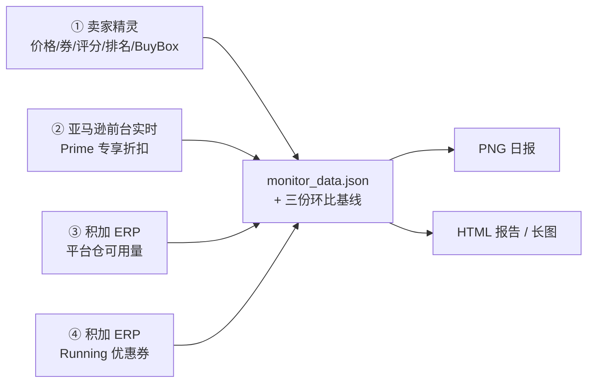

# ASIN Health — 亚马逊 ASIN 每日监控日报

盯自己家的 ASIN：**一张表看全部关键维度，每天出图 + 出报告，异常自动标红。**

换品牌、换站点只改一个 `config/config.json`，代码一行都不用动。

---

## 它能看什么（12 列）

| 列 | 数据源 | 异常判定 |
|---|---|---|
| ASIN / 产品 | `config.json` | 行序 = 清单顺序 |
| 可售状态 | 卖家精灵 | 有返回 = 可售 |
| Buy Box | 卖家 ID + 配送方式 | 非品牌方 或 非 FBA → **红字异常** |
| 价格（到手价） | 卖家精灵 | 与上一交易日基线不一致 → **红字异常** |
| Coupon | 卖家精灵，空时用 ERP 兜底 | 昨日有今日无 → **红「券消失」** |
| Prime 专享 | **亚马逊前台实时抓取** | 做折扣 → 紫字 `Prime$29.99`；没做 → 留空 |
| Rating | 卖家精灵 | 累计评论数，`+N` 为环比增量 |
| Review | 卖家精灵 | 星级 0–5（★4.6） |
| 大类排名 | 卖家精灵 BSR | 波动 ≥ 1000 名 → **红字异常** |
| 小类排名 | 卖家精灵 BSR（末级类目） | 波动 ≥ 10 名 → **红字异常** |
| FBA 库存预警 | 积加 ERP | 可售天数 < 20 天 → **红「异常 · N天」** |

阈值都能在 config 里改（`thresholds.grossRank` / `subRank` / `fbaDays`）。

## 产出两样东西

1. **PNG 日报图** —— 12 列横向表格，直接推到企业微信。
2. **单文件 HTML 报告** —— 监控数据在前、日报总结在后、附口径与判定规则表。
   样式内联、零外部依赖，浏览器 Ctrl+P 可直接导出 PDF；也能一键渲染成整页长图。

---

## 数据链



三条兜底线都是有原因的，别省：

- **Prime 专享走前台实时**：卖家精灵的 `primePrice` 会成批漏抓（同一批数据几分钟内从有值变成全 `-1`），
  而前台明明挂着 `Exclusive Prime price`。只信工具源会让整列假空白。
- **Coupon 用 ERP 兜底**：卖家精灵的 `coupon` 同样会成批漏抓，直接采信会每天误报一堆「券消失」。
- **库存用 ERP 平台仓可用量**：商品列表里的「可履约数量」口径更小，会系统性低估可售天数。

> **第一铁律**：实时促销维度以平台前台实测为准，工具源只用于历史与趋势；
> 工具源成批漏抓时**必须显式告警，绝不静默降级**。列错值比缺值危险。

---

## 环境前置

1. **Python 3.8+**，出图需 `Pillow`
   ```bash
   pip install pillow
   ```
2. **三个 MCP 服务**（在 WorkBuddy 里连接，鉴权自动写入 `~/.workbuddy/mcp.json`）

   | 服务名（可改） | 用途 | 缺了会怎样 |
   |---|---|---|
   | `sellersprite-universal` | 价格 / 券 / 评分 / 排名 / BuyBox | 致命：取数直接失败 |
   | `gerp-ads` | ERP 优惠券报表（券兜底） | coupon 列误报「券消失」 |
   | `gerp-inventory` | ERP 平台仓库存（FBA 预警） | 库存列显示「—」 |

3. **BrowserSkill（bsk）** —— 只用于 Prime 专享这一列。CLI + 浏览器扩展，
   且要装在**平时已登录亚马逊的那个浏览器**上。验证：
   ```bash
   bsk doctor     # 三项全绿：daemon running / extension connected
   ```

   没有浏览器也能跑，其余 11 列不受影响（Prime 列会打印显式告警）。

   > **Windows 坑**：`bsk daemon start` 直接跑会报
   > `os error 5 / cannot start an independent Windows daemon`。
   > 必须**前台模式挂后台**：`bsk daemon start --foreground`（放到后台任务里跑），
   > 等 6 秒后 `bsk doctor` 确认。`BSK_AUTO_START=0` 可避免 CLI 自己乱拉 daemon。

---

## 快速开始

**1. 放进技能目录**

```bash
git clone https://github.com/0216marisolmao/ASIN-Health.git
mv ASIN-Health ~/.workbuddy/skills/amazon-asin-daily-monitor
```

**2. 配 config**

```bash
cp config/config.example.json config/config.json
```

六处必填，其余有默认值：

| 字段 | 说明 |
|---|---|
| `asinList` | `[{"asin": "B0XXXXXXXX", "name": "产品中文简称"}]`，**行序即报表行序** |
| `brandSellerIds` | 品牌方卖家 ID。找法：卖家精灵 `getAsinDetail` 看自己 Listing 的 `sellerId`，或前台商品页点「Sold by」看链接里的 `seller=` |
| `erp.marketId` | 积加 ERP 目标店铺 ID。调 `post_middle_base_polymerizeMarketSimple_list` 查 |
| `erp.warehouseName` | ERP「平台仓库存」的仓库名，形如 `<品牌>:<站点>_FBA`。**填错会库存全空**（接口返回所有站点仓，脚本按仓库名严格过滤） |
| `site` | `marketplace` / `domain` / `label` / `currency` / `timezone` |
| `thresholds` | `grossRank`(1000) / `subRank`(10) / `fbaDays`(20) |

**3. 跑**

```bash
python scripts/run_pipeline.py                    # 全流程
python scripts/run_pipeline.py --skip-prime       # 没开浏览器时
python scripts/run_pipeline.py --with-report-png  # 额外出报告长图
```

首次运行自动创建输出目录（`outputs.dir`，默认 `data/`）。

**4. 接自动化**

每日固定时间跑 `run_pipeline.py`，再把 `asin_monitor_daily.png` 推到你自己的消息通道。

> **排名预警需要两天生效**：首次运行只建立排名基线，自第二次采集起才开始判定波动。
> 这是防误报设计 —— 没有基准就不瞎报。

---

## 目录结构

```
.
├── SKILL.md                       技能说明书（完整口径、踩坑记录）
├── README.md                      本文件
├── config/config.example.json     复制为 config.json 后填写
├── templates/report_template.html 内置 HTML 报告模板（样式 + 口径表，占位符注入）
└── scripts/
    ├── cfgpath.py                 config 定位 + 输出目录解析（唯一路径入口）
    ├── mcpclient.py               MCP(HTTP JSON-RPC) 客户端，429 自动退避
    ├── fetch_sellersprite.py      ① 取数 + 滚动三份环比基线
    ├── fetch_prime.py             ② Prime 专享：前台实时
    ├── fetch_fba_inventory.py     ③ ERP 平台仓可用量
    ├── apply_erp_coupons.py       ④ ERP 券兜底修正 coupon 列
    ├── apply_fba_stock.py         ⑤ 注入库存 + 算可售天数预警
    ├── generate_monitor_image.py  ⑥ 出 PNG 日报
    ├── build_report.py            ⑦ 出 HTML 报告
    ├── render_report_png.py       ⑧ 报告整页长图
    ├── run_pipeline.py            一键跑 ①–⑦（可选 ⑧）
    ├── frontend_prime_probe.js    前台探针（Prime 专享判定）
    └── pack_skill.py              打包 + 脱敏 + 敏感信息扫描
```

---

## 口径红线（混用必误报）

- **价格环比只能用同口径的到手价 + 自建 `price_baseline.json`。**
  历史接口的 `price` 是**标价**（实例：某 ASIN 标价长期 59.99、到手价 41.99），拿它比价会让整列误报异常。
- `history.couponPrice` 是**券面额**（5% 券会被折成金额如 1.10），只用于判「昨日有无券」，不用于展示。
- ERP 券的 `discountAmount.currencyAmount` 对百分比券不可信（5% 也显示 $5.00），
  判券值只认 `discountType` + `discount`。
- 库存分子**只能用平台仓可用量**。同一 ASIN 在同一仓库下可能有多条 MSKU（老 SKU 常年 0 库存），
  必须取**有库存的那条**。
- **类目变更不环比**：亚马逊调类目后新旧排名不可比，脚本自动跳过并告警。
- **变体家族排名 / 评论共享**：同父体的多个子 ASIN 会拿到相同的排名与评论数，属正常现象。

---

## 已知坑

- **卖家精灵 429 限流**：突发请求下网关返回 429，`mcpclient.py` 已自动退避重试。
  退化批次的特征是「coupon 全空 + primePrice 全 -1 同时出现」—— **这不代表促销真的结束了**。
- **排名基线首日不判异常**：新接入时首次快照只建基线。
- **报告文件名含中文**：`render_report_png.py` 会先复制成 ASCII 临时名再喂给浏览器（URL 编码坑）。
- **截图视口宽度**：默认 1600，低于页面 `max-width` 时右侧列会被容器裁掉（`outputs.pngWidth` 可调）。
- **`bsk` 用 `.exe` 直调**：Windows 上 `.cmd` 包装器在 subprocess 下不稳。
- **别把 `data/` 提交或外发**：里面是真实经营数据与历史基线（已在 `.gitignore` 里屏蔽）。

---

## 二次开发

改完脚本或模板后重新打包：

```bash
python scripts/pack_skill.py
```

会做白名单收包（`data/`、`config.json`、缓存、运行产物一律不进包）+ 全量敏感信息扫描
（MCP token / Bearer / Authorization / webhook key / api key / 企业微信 ID / 已知泄露串；
「填 / YOUR / 占位」模板值豁免）。**扫描不过 = 退出码 1，包严禁外发。**

要给客户换列名或加列，改 `templates/report_template.html` + `build_report.py` 的 `build_data_row` 即可
（模板里任何 `{{TOKEN}}` 都会被脚本替换，未被替换的占位符会在运行日志里告警）。

---

## 免责声明

本项目使用各数据服务商的公开/授权接口，请遵守对应平台的服务条款。
`config.example.json` 中的字段说明仅供参考，实际取值请以你自有账号的授权数据为准。
